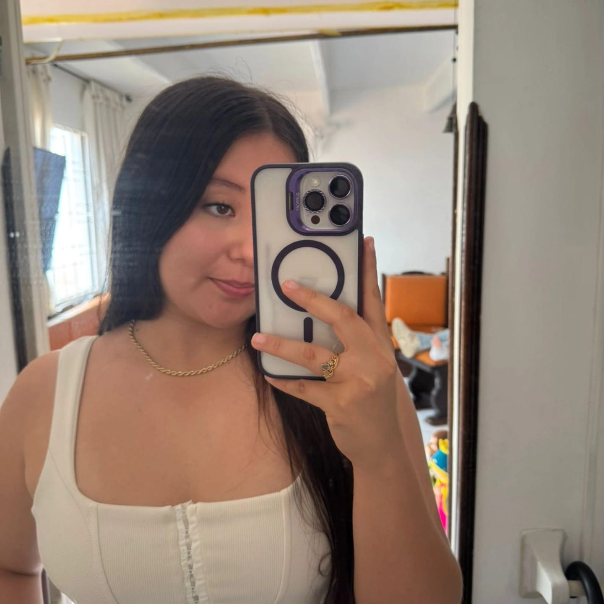

<html>
<head>
  <link rel="stylesheet" href="style.css">
</head>

<body >

  <h1><b>Biografía de Paula Andrea Suárez Bustamante</b></h1>

  

   
Mi nombre es Paula Andrea Suárez Bustamante. 
    Nací el <u>18 de abril del 2006</u> en <b>Bucaramanga</b>. Mis padres se llaman <i>Edinson Suárez</i> y <i>Cristina Bustamante</i>, y tengo tres hermanas:
     <b>Camila</b>, <b>Crisbel</b> y <b>Gabriela</b>.

  
Cuando era pequeña, vivía con mis abuelos en un pueblo llamado <u>Tibú</u>, en <i>Norte de Santander</i>. A los ocho años me vine a vivir a Bucaramanga con mi mamá, y allí continué mis estudios en <b>Girón</b>.

  
Me considero una persona responsable y con grandes metas.

  

  <h2>🎯 Hobbies</h2>
  <ul>
    <li>📣 Porrismo</li>
    <li>🛼 Patinaje</li>
    <li>🏊‍♀️ Natación</li>
    <li>🍳 Cocinar</li>
    <li>🛌 Dormir</li>
    <li>🎨 Dibujar</li>
    <li>🐶 Pasar tiempo con los perros</li>
  </ul>

  

  <h2>🏆 Logros personales</h2>
  <ol>
    <li>📈 Mantener buenas calificaciones</li>
    <li>🌟 Ser reconocida como líder</li>
    <li>💪 Superar momentos difíciles</li>
  </ol>
   
</body>
</html>
